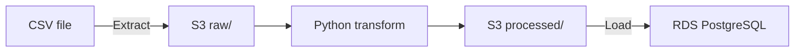

# Banking Transactions ETL Pipeline

A batch ETL (Extract, Transform, Load) pipeline that takes a messy daily banking transactions file, stages it in AWS S3 (Simple Storage Service), cleans it with Python, and loads it into AWS RDS (Relational Database Service) PostgreSQL. Every stage is verified before the data moves on.

## Architecture



## What the Pipeline Fixes

| Problem in raw file | Fix |
|---|---|
| Mixed-case account types (`SAVINGS`, `Savings`) | Converted to lowercase |
| 3 date formats (`2026-09-15`, `15/09/2026`, `Sep 15 2026`) | Converted to one format, and unknown formats stop the pipeline |
| Duplicate transaction IDs | Removed, and blocked by the table's primary key |
| Missing amounts | Removed, and blocked by `NOT NULL` |

## Tech Stack

AWS S3, AWS RDS PostgreSQL, Python (boto3, pandas, psycopg2), SQL, and Linux.

## Project Structure

```
banking-etl/
├── data/transactions_2026-09-15.csv   # sample messy input (fake data)
├── config.py                          # settings read from environment variables
├── test_connection.py                 # checks S3 and RDS access
├── inspect_data.py                    # profiles the raw file
├── extract.py                         # uploads the raw file to S3 raw/
├── transform.py                       # cleans the data and saves to S3 processed/
├── create_table.sql                   # transactions table with data rules
├── load.py                            # upserts clean data into RDS
└── requirements.txt                   # Python libraries
```

## Setup

1. Create an S3 bucket with `raw/` and `processed/` folders, and an RDS PostgreSQL database reachable from your machine.
2. Set up Python:

```bash
python3 -m venv .venv --prompt banking-etl
source .venv/bin/activate
pip install -r requirements.txt
```

3. Set environment variables (never commit real values):

```bash
export AWS_REGION=ca-central-1
export BUCKET=your-bucket-name
export DB_HOST=your-database-endpoint
read -s DB_PASSWORD && export DB_PASSWORD
export PGPASSWORD="$DB_PASSWORD"
```

## Run the Pipeline

Run all commands from the project folder.

```bash
python test_connection.py                                            # check access
python inspect_data.py                                               # profile raw data
python extract.py                                                    # extract to S3
python transform.py                                                  # transform
psql -h $DB_HOST -U etladmin -d bankingdb -f create_table.sql        # create table
python load.py                                                       # load to RDS
```

## Verification Results

The data was checked with three independent tools: Linux commands, pandas, and SQL.

| Check | Raw file | After pipeline |
|---|---|---|
| Rows | 54 | 47 |
| Duplicate IDs | 4 | 0 |
| Missing amounts | 3 | 0 |
| Account type spellings | 8 | 3 |
| Date formats | 3 | 1 |

The load uses an upsert, so running it twice still leaves 47 rows.

## Security

- No passwords, keys, or database addresses are stored in the code. All sensitive values come from environment variables.
- The database only accepts connections from one approved IP address.
- A security scan was run before the first commit.


